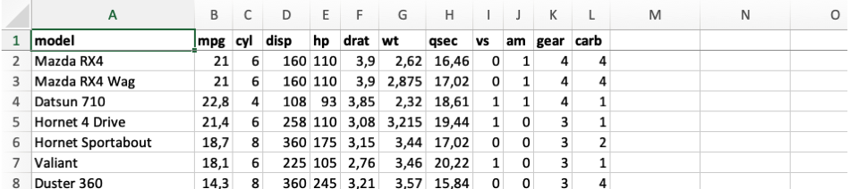
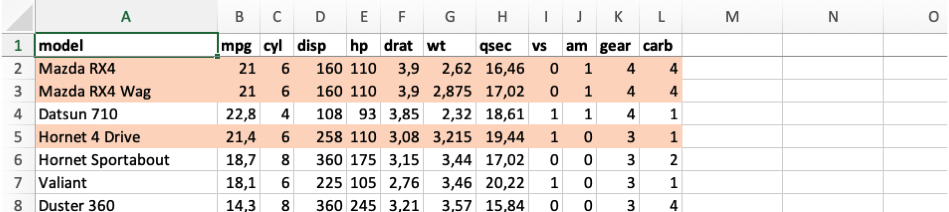
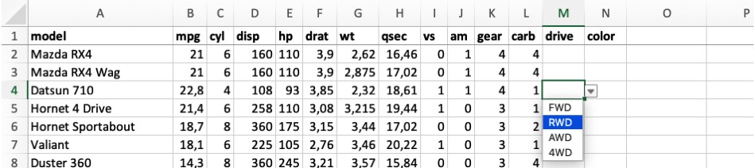
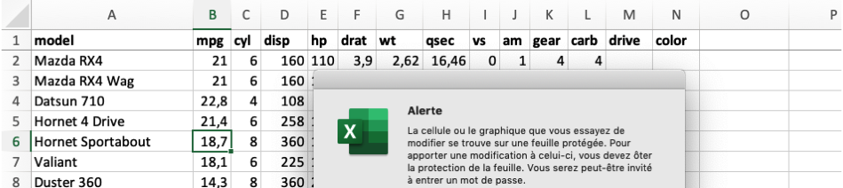
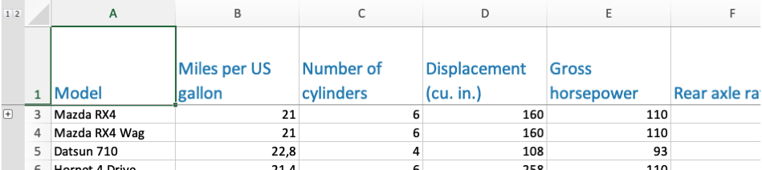

<!-- README.md is generated from README.Rmd. Please edit that file -->

```{r, echo = FALSE}
options(digits = 4, width = 120)
```

# qxl: Write quick, customized .xlsx files
<!-- badges: start -->
[](https://www.tidyverse.org/lifecycle/#experimental)
<!-- badges: end -->

A wrapper to the [openxlsx](https://github.com/ycphs/openxlsx) package optimized
for writing flat data structures. Includes arguments to quickly add
customization like:

- conditional formatting written as R expressions
- data validation rules based on a tidy dictionary structure
- column-specific worksheet protection
- custom column names with original variable-names hidden in the row below

### Installation

Install from GitHub with:

```{r, eval=FALSE}
# install.packages("remotes")
remotes::install_github("epicentre-msf/qxl")

# if using an older version of remotes pkg, may need to specify branch 'main'
# remotes::install_github("epicentre-msf/qxl@main")
```


### Usage

```{r}
library(qxl)

# dataset and output path for examples
mtcars_tbl <- tibble::rownames_to_column(mtcars, "model") 
path_write <- tempdir()
```

#### Default output

```{r}
qxl(
  mtcars_tbl,
  file = file.path(path_write, "mtcars_default.xlsx")
)
```



#### Conditional formatting

```{r}
qxl(
  mtcars_tbl,
  file =  file.path(path_write, "mtcars_cond.xlsx"),
  style1 = qstyle(
    rows = cyl >= 6 & mpg > 20,
    # cols = c(cyl, mpg), # can optionally limit to specific columns
    bgFill = "#fddbc7"
  )
)
```



#### Data validation

```{r}
mtcars_tbl$drive <- NA_character_
mtcars_tbl$color <- NA_character_

qxl(
  mtcars_tbl,
  file =  file.path(path_write, "mtcars_valid.xlsx"),
  validate = list(
    drive = c("FWD", "RWD", "AWD", "4WD"),
    color = c("red", "blue", "grey", "black")
  )
)
```



Instead of passing a list to argument `validate`, as above, could alternatively
use a data frame with variable names in the first column and corresponding
options in the second column.

#### Cell protection

```{r}
qxl(
  mtcars_tbl,
  file =  file.path(path_write, "mtcars_protect.xlsx"),
  protect = qprotect("my_password", cols = model:carb)
)
```



#### Customized header

```{r}
header_names <- c(
  model = "Model",
  mpg = "Miles per US gallon",
  cyl = "Number of cylinders",
  disp = "Displacement (cu. in.)",
  hp = "Gross horsepower",
  drat = "Rear axle ratio",
  wt = "Weight (1000s of lbs)",
  qsec = "1/4 mile time",
  vs = "Engine type (0 = V-shaped, 1 = straight)",
  am = "Transmission (0 = automatic, 1 = manual)",
  gear = "Number of forward gears",
  carb = "Number of carburators",
  drive = "Drivetrain",
  color = "Color (exterior)"
)

qxl(
  mtcars_tbl,
  file = file.path(path_write, "mtcars_header.xlsx"),
  header = header_names,
  style_head = qstyle(
    rows = 1,
    fontSize = 15,
    fontColour = "#2b8cbe",
    wrapText = TRUE
  ),
  col_widths = 16
)
```



Note that the second row, which contains the original variable names, is hidden
in the output above. To read the file back in we can use the `skip` argument of
[`readxl::read_xlsx`](https://readxl.tidyverse.org/) to get the original
variable names instead of the human-readable version.

```{r}
readxl::read_xlsx(file.path(path_write, "mtcars_header.xlsx"), skip = 1)
```

