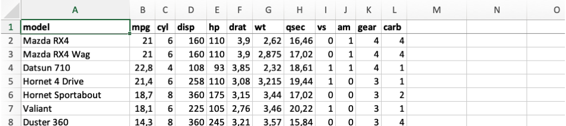
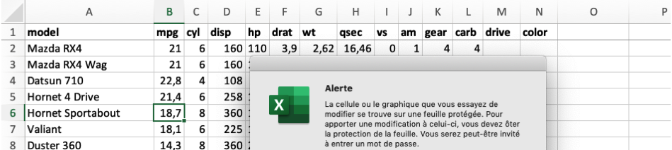
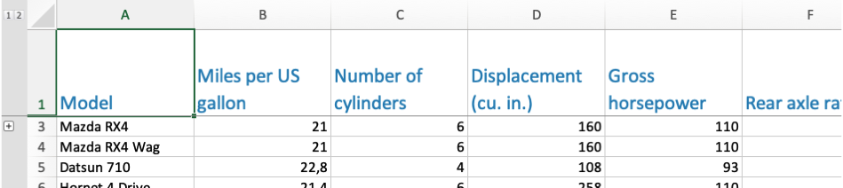

<!-- README.md is generated from README.Rmd. Please edit that file -->

# qxl: Write quick, customized .xlsx files

<!-- badges: start -->

[](https://www.tidyverse.org/lifecycle/#experimental)
<!-- badges: end -->

A wrapper to the [openxlsx](https://github.com/ycphs/openxlsx) package
optimized for writing flat data structures. Includes arguments to
quickly add customization like:

-   conditional formatting written as R expressions
-   data validation rules based on a tidy dictionary structure
-   column-specific worksheet protection
-   custom column names with original variable-names hidden in the row
    below

## Installation

Install from GitHub with:

``` r
# install.packages("remotes")
remotes::install_github("epicentre-msf/qxl")

# if using an older version of remotes pkg, may need to specify branch 'main'
# remotes::install_github("epicentre-msf/qxl@main")
```

## Usage

``` r
library(qxl)

# dataset and output path for examples
mtcars_tbl <- tibble::rownames_to_column(mtcars, "model") 
path_write <- tempdir()
```

### Default output

``` r
qxl(
  mtcars_tbl,
  file = file.path(path_write, "mtcars_default.xlsx")
)
```



### Conditional formatting

``` r
qxl(
  mtcars_tbl,
  file =  file.path(path_write, "mtcars_cond.xlsx"),
  style1 = qstyle(
    rows = cyl >= 6 & mpg > 20,
    # cols = c(cyl, mpg), # can optionally limit to specific columns
    bgFill = "#fddbc7"
  )
)
```


### Data validation

``` r
mtcars_tbl$drive <- NA_character_
mtcars_tbl$color <- NA_character_

qxl(
  mtcars_tbl,
  file =  file.path(path_write, "mtcars_valid.xlsx"),
  validate = list(
    drive = c("FWD", "RWD", "AWD", "4WD"),
    color = c("red", "blue", "grey", "black")
  )
)
```


Instead of passing a list to argument `validate`, as above, could
alternatively use a data frame with variable names in the first column
and corresponding options in the second column.

### Cell protection

``` r
qxl(
  mtcars_tbl,
  file =  file.path(path_write, "mtcars_protect.xlsx"),
  protect = qprotect("my_password", cols = model:carb)
)
```



### Customized header

``` r
header_names <- c(
  model = "Model",
  mpg = "Miles per US gallon",
  cyl = "Number of cylinders",
  disp = "Displacement (cu. in.)",
  hp = "Gross horsepower",
  drat = "Rear axle ratio",
  wt = "Weight (1000s of lbs)",
  qsec = "1/4 mile time",
  vs = "Engine type (0 = V-shaped, 1 = straight)",
  am = "Transmission (0 = automatic, 1 = manual)",
  gear = "Number of forward gears",
  carb = "Number of carburators",
  drive = "Drivetrain",
  color = "Color (exterior)"
)

qxl(
  mtcars_tbl,
  file = file.path(path_write, "mtcars_header.xlsx"),
  header = header_names,
  style_head = qstyle(
    rows = 1,
    fontSize = 15,
    fontColour = "#2b8cbe",
    wrapText = TRUE
  ),
  col_widths = 16
)
```



Note that the second row, which contains the original variable names, is
hidden in the output above. To read the file back in we can use the
`skip` argument of [`readxl::read_xlsx`](https://readxl.tidyverse.org/)
to get the original variable names instead of the human-readable
version.

``` r
readxl::read_xlsx(file.path(path_write, "mtcars_header.xlsx"), skip = 1)
```

    ## # A tibble: 32 x 14
    ##    model               mpg   cyl  disp    hp  drat    wt  qsec    vs    am  gear  carb drive color
    ##    <chr>             <dbl> <dbl> <dbl> <dbl> <dbl> <dbl> <dbl> <dbl> <dbl> <dbl> <dbl> <lgl> <lgl>
    ##  1 Mazda RX4          21       6  160    110  3.9   2.62  16.5     0     1     4     4 NA    NA   
    ##  2 Mazda RX4 Wag      21       6  160    110  3.9   2.88  17.0     0     1     4     4 NA    NA   
    ##  3 Datsun 710         22.8     4  108     93  3.85  2.32  18.6     1     1     4     1 NA    NA   
    ##  4 Hornet 4 Drive     21.4     6  258    110  3.08  3.22  19.4     1     0     3     1 NA    NA   
    ##  5 Hornet Sportabout  18.7     8  360    175  3.15  3.44  17.0     0     0     3     2 NA    NA   
    ##  6 Valiant            18.1     6  225    105  2.76  3.46  20.2     1     0     3     1 NA    NA   
    ##  7 Duster 360         14.3     8  360    245  3.21  3.57  15.8     0     0     3     4 NA    NA   
    ##  8 Merc 240D          24.4     4  147.    62  3.69  3.19  20       1     0     4     2 NA    NA   
    ##  9 Merc 230           22.8     4  141.    95  3.92  3.15  22.9     1     0     4     2 NA    NA   
    ## 10 Merc 280           19.2     6  168.   123  3.92  3.44  18.3     1     0     4     4 NA    NA   
    ## # … with 22 more rows

### Writing a workbook with multiple sheets

To write a multi-sheet workbook where all sheets have the same (if any)
styling, validation, and protection, we can simply pass a list of data
frames to `qxl`.

``` r
mtcars_split <- split(mtcars_tbl, mtcars_tbl$am)
names(mtcars_split) <- c("automatic", "manual")

qxl(
  mtcars_split,
  file = file.path(path_write, "mtcars_split.xlsx")
)
```

If the different worksheets need to vary in their styling, validation,
or protection, then we will need multiple calls to `qxl`, with the
workbook argument `wb` carried forward at each step, which can be done
for example with piping.

``` r
library(dplyr, warn.conflict = FALSE)

wb_mtcars <- qxl(
  mtcars_split$automatic,
  sheet = "automatic"
) %>% 
  qxl(
    mtcars_split$manual,
    wb = .,
    sheet = "manual",
    # style only for sheet 'manual'
    style1 = qstyle(hp > 200, bgFill = "#9ecae1")
  )

qwrite(
  wb_mtcars,
  file = file.path(path_write, "mtcars_split_custom.xlsx")
)
```
